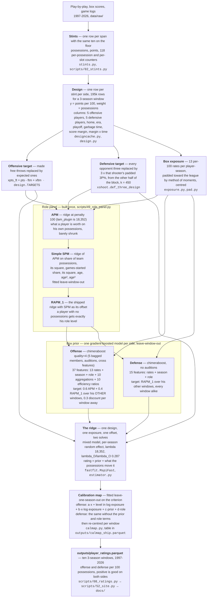
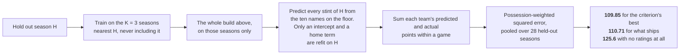

# How the model works

Two loops. The **build** turns play-by-play into a rating for every player-window. The **criterion** holds a
season out and scores the build against games it never saw; it is what every choice below was selected on.
Nothing here is a preference — each box is in the code at the file named beside it.

---

## 1. The build

The two sides take **different priors on purpose**: the criterion wants the bagged, searched booster and the
richer feature set, and the consensus floors do not tolerate either on defense (FINDINGS 21.26). Only the
calibration map couples them, because its parameters are fitted jointly on the team-game residual.

---

## 2. The criterion

`holdout.py` is the runner, `scripts/54_track.py` the tracker that logs a row to `docs/progress.csv` and
redraws `docs/progress.png`. It is the one test in the project that is both external to the model (it scores
actual points in a season the ratings never saw) and legal to select on (it uses no outside data).

**Two terms live only here and cannot ship**, because a rating is a number attached to one player:

- the player's **age in H**, quadratic — a window has no single "age at H";
- a **cubic in the team-game total** and **the same cubic at stint level**, worth 0.28 per 100 together — a
  rating carries no team, and the criterion's prediction is the sum of the five on the floor.

The consensus (`data/external/consensus.csv`, the owner's blend of public metrics) is **validation only**: read
once, never selected on. Ten floors in `tests/test_vs_consensus.py` decide whether a board may ship at all.

---

## 3. What each stage is for

| stage | the problem it solves |
|---|---|
| stints | five players share every possession; the only unit that identifies them is the lineup change |
| luck adjustment | whether an opponent's three drops is almost pure noise, and free-throw shooting is one identified player with no defense |
| box exposure | the 13 rates are the only per-player description the box score gives, and a 200-possession player's rates need padding |
| APM → SPM → RAPM_1 | a target for the prior that is not itself the thing being predicted, with a role level for players the possessions cannot see |
| the boosted prior | what a player's box line is worth on court, learned from his *other* windows so it can never memorise the one being fitted |
| the ridge | ten collinear players per row; the penalty is what makes the system solvable, and the prior is where a low-minute player starts |
| the calibration map | the ridge over-shrinks, and by an amount that depends on how many possessions it saw |
| the criterion | everything above has a knob, and this is the only thing allowed to turn one |
