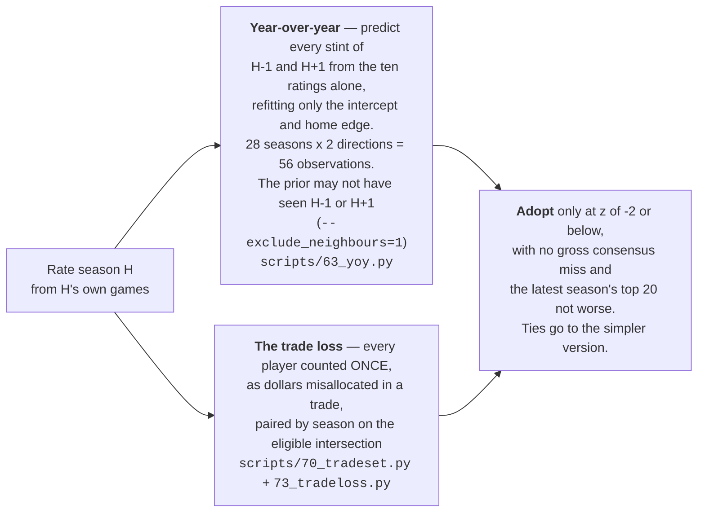
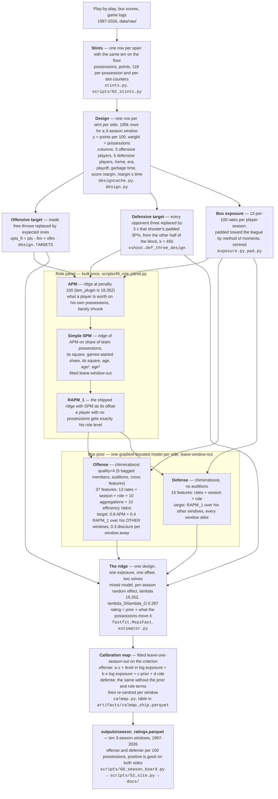
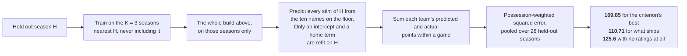

# How the model works

Two builds live in this repo. **What the site publishes is the single-year rankings** of
`scripts/62_single_year_board.py` — section 1 below. The three-season-window board of
`scripts/60_season_board.py` — section 3 — is still built, still scored and still read by several
tests, but nothing on `docs/` comes from it. The two share the stints, the design, the padded
exposures and the idea of a box prior; they differ in the label, the prior's training rows, the
ridge and the criterion.

Nothing here is a preference — each box is in the code at the file named beside it, and every choice
was made on the criterion in section 2. Boxes drawn in **orange are the wrinkles**: the places this
departs from a textbook RAPM, listed with their reasons under the chart.

---

## 1. What ships: one rating per player per season

One rating per player per season, from **that season's games only**. A player's other seasons may
reach his rating's coefficients; they may never reach his rating ("single year or bust").

```mermaid
flowchart TD
    RAW["Play-by-play and box scores, 1997-2026<br/><code>ingest.py</code>, <code>scripts/01_ingest.py</code>"]
    ST["<b>Stints</b> — one row per span with the same ten on the floor<br/>possessions, points, 118 per-possession and per-slot counters<br/><code>stints.py</code>, <code>scripts/02_stints.py</code>"]
    DES["<b>Design</b> — one row per stint per side<br/>10 player columns, plus home, playoff, garbage time,<br/>score margin, margin x time<br/>y = points per 100, weight = possessions<br/><code>design.py</code>, <code>designcache.py</code>"]
    PAN["<b>Season panel</b> — one row per player-season-side:<br/>13 per-100 rates padded toward the league by method of moments,<br/>ten derived combinations, ten ratios, six shot-quality columns,<br/>role, age, bio, his own on-court record<br/><code>scripts/49_role_panel.py --season</code>, <code>exposure.py</code>, <code>pad.py</code>"]

    TGO["<b>Offensive target</b> <code>xpts_ft</code><br/>made free throws replaced by the shooter's padded expectation"]
    TGD["<b>Defensive target</b> <code>x3def_w0.25</code><br/>three quarters of every opponent three-point make replaced by<br/>3 x that shooter's own padded 3P%, k = 450 attempts<br/><code>xshoot.def_three_design</code>"]

    RAW --> ST --> DES
    ST --> PAN
    DES --> TGO
    DES --> TGD

    subgraph LAB["The label — what the box prior is taught to predict"]
        LOO["<b>Leave-season-out RAPM</b> — one rating per PLAYER over every<br/>season EXCEPT the one being rated, penalties 40,000 / 40,000 / 0<br/>each season's context columns kept separately<br/>normal equations added up once, so each held-out season is one solve<br/><code>looseason.LeaveSeasonOutRAPM</code>"]
        UNS["<b>Un-shrink the DEFENSIVE label</b> — divide out the ridge's own<br/>n / (n + lambda), capped at a 4,444-possession floor; what the cap<br/>leaves is filled from the player's possession tier's mean level<br/>so a 200-possession man sits at his kind's replacement level, not 0<br/><code>62_single_year_board.unshrink_label</code>"]
        LOO --> UNS
    end

    TGO --> LOO
    TGD --> LOO

    subgraph PRI["The box prior — a gradient-boosted SPM, one per side"]
        ROWS["<b>Chunk rows</b> — his career row PLUS every contiguous 1-, 2- and<br/>3-season run of it, all carrying the same label, with<br/><code>chunk_poss</code> and <code>chunk_seasons</code> saying how much evidence each rests on<br/><code>singleyear.chunk_rows</code>"]
        FOLD["<b>Five player folds, balanced on the label</b><br/>every player's prior comes from the fit that never saw a row of his<br/><code>OutOfPlayerSPM</code>, <code>singleyear.stratified_player_folds</code>"]
        BOOST["<b>chimeraboost</b> — 21 offensive / 17 defensive features,<br/>BorutaShap-selected<br/>then asked about the rated season's OWN box line<br/><code>singleyear.feature_set</code>, <code>gbdt_prior.py</code>"]
        ROWS --> FOLD --> BOOST
    end

    UNS --> ROWS
    PAN --> ROWS
    PAN --> BOOST

    subgraph RID["The rating — the season's own possessions"]
        RIDGE["<b>PriorRidgeCV</b> — shrink toward the PRIOR, not toward zero<br/>rating = scale x prior + residual<br/>residual penalty fixed at 13,037 on both sides, context penalty 0<br/>folds are whole GAMES; the objective is team-game error<br/>weighted toward close games<br/><code>priorridge.PriorRidgeCV</code>"]
        XF["<b>The scale is priced on cross-fitted prior columns</b><br/>for each game fold the on-court columns are rebuilt from the<br/>training games alone and the boosters re-asked, so the free scale<br/>never reads back the outcomes of the games it is scored on<br/><code>_fold_prior_builder</code>, <code>--crossfit=scale</code>"]
        XF --> RIDGE
    end

    BOOST --> RIDGE
    BOOST --> XF
    TGO --> RIDGE
    TGD --> RIDGE

    CEN["<b>Centre</b> — per season and side, the possession-weighted mean<br/>of the rating is zero: the average possession is played by a zero player"]
    RIDGE --> CEN

    OUT["<b>outputs/season_ratings_product.parquet</b><br/>one row per player-season, offense and defense per 100 possessions,<br/>positive good on both ends"]
    CEN --> OUT
    OUT --> SITE["<code>scripts/52_site.py</code> → <code>docs/data/ratings.json</code> → <code>docs/index.html</code>"]
    OUT --> BIAS["<code>scripts/76_bias_groups.py</code> → <code>docs/bias.html</code><br/>bias by player type, against the consensus and against 2026 observed"]

    classDef wrinkle fill:#fde6cc,stroke:#c2702a,color:#000
    class TGO,TGD,LOO,UNS,ROWS,FOLD,XF,CEN wrinkle
```

### What a textbook RAPM does, and what this does instead

| | a normal RAPM | here | why |
|---|---|---|---|
| **the target** | actual points per 100 | two targets, one per side: expected free throws on offense, three quarters of every opponent three replaced by the shooter's own padded 3P% on defense — **two designs, two ridges, one side taken from each** | whether an opponent's three drops needs 4,000-7,000 attempts to stabilise, so the defenders' coefficients were being fit to noise. Both adjustments are measured variance reductions on the criterion. The adjustment is a *fitting* target only — scoring is always against points actually scored |
| **the prior** | none, or a linear box-score SPM | a gradient-boosted SPM whose **label is a leave-season-out RAPM: one rating per player over every season but the rated one** | the old label (one season, heavily shrunk toward a linear fit) was 97.6% correlated with that fit, so the prior was learning to predict its own input |
| **the label's scale** | — | the **defensive** label is divided by its own shrinkage factor, capped at a possession floor, the remainder filled from the player's tier mean | a ridge keeps 57% of a 54,000-possession player's impact and 6% of a 2,600-possession one's, so the raw label's spread grows fifteen-fold with career length and the prior learns "long career = big number". Offense is deliberately left shrunk — un-shrinking both collapses the 2026 offensive spread from 1.60 to 1.14 |
| **the prior's training rows** | one row per player-season | the career row **plus every contiguous 1-, 2- and 3-season chunk**, all carrying the career label, with two features saying how much evidence each row rests on | it shows the booster the same player at several noise levels, which is the padding question learned from data instead of set per statistic. A player's chunk rows together weigh what his career row weighs |
| **who fits the prior** | one fit for everyone | **five player folds**, balanced on the label; a player's prior comes from the fit that never saw a row of his | otherwise the booster can recognise a player's box fingerprint and hand back his career number, which would be his other seasons reaching his rating |
| **the shrinkage centre** | zero | the prior, at a **freely fitted scale**: `scale x prior + residual` | a player with no minutes should come out at what the box score says he is, not at league average |
| **how the scale is priced** | — | on **cross-fitted** prior columns: per game fold, the prior's on-court columns are rebuilt without that fold's games | the on-court columns average the whole season, so an uncross-fitted scale reads back the outcome of the very games it is scored on, and comes out too big |
| **choosing the penalty** | CV on random stint folds | folds are **whole games**; the objective is a **team-game error weighted toward close games**; and in the shipped run the player penalty is not cross-validated at all — fixed at **13,037**, chosen once on the year-over-year test | the ten on the floor repeat across a game's stints, so splitting inside a game leaks the answer across the fold. A stint MSE is mostly binomial noise. A 30-point blowout says less about who is good than a game decided by two |
| **the level** | implicit | **centred per season and side** at possession-weighted zero | the prior's mean is not zero and the free scale multiplies it: +1.47 on offense in 2026 before centring |

Two more that are not in the chart:

- **The rates the prior sees are padded**, per statistic, by method of moments toward the league — a
  200-possession player's per-100 rates are otherwise mostly noise (`pad.py`, `exposure.py`).
- **The consensus of public metrics is validation only.** It is read after every experiment and can
  veto one, and it is never a fitting target (`tests/test_vs_consensus.py`,
  `scripts/64_consensus_report.py`).

---

## 2. The criterion

Everything above has a knob, and two tests are allowed to turn one. Neither uses outside data.

```mermaid
flowchart LR
    R["Rate season H<br/>from H's own games"] --> YOY["<b>Year-over-year</b> — predict every stint of<br/>H-1 and H+1 from the ten ratings alone,<br/>refitting only the intercept and home edge.<br/>28 seasons x 2 directions = 56 observations.<br/>The prior may not have seen H-1 or H+1<br/>(<code>--exclude_neighbours=1</code>)<br/><code>scripts/63_yoy.py</code>"]
    R --> TR["<b>The trade loss</b> — every player counted ONCE,<br/>as dollars misallocated in a trade,<br/>paired by season on the eligible intersection<br/><code>scripts/70_tradeset.py</code> + <code>73_tradeloss.py</code>"]
    YOY --> D["<b>Adopt</b> only at z of -2 or below,<br/>with no gross consensus miss and<br/>the latest season's top 20 not worse.<br/>Ties go to the simpler version."]
    TR --> D
```

The year-over-year test is an error per team-game, so a 200-possession player is a rounding error in
it; the trade loss is what can see him. The incumbent reads **8.682** points per 100 per team-game.

---

## 3. The older three-season-window board

`scripts/60_season_board.py` → `outputs/season_ratings.parquet`. Not published since 2026-09; kept
because several tests read `artifacts/season_ratings.parquet`, and because the criterion in 3.2 is
what selected the stints, the design, the targets and the exposures that section 1 inherited.

### 3.1 The build

```mermaid
flowchart TD
    RAW["Play-by-play, box scores, game logs<br/>1997-2026, data/raw/"]
    ST["<b>Stints</b> — one row per span with the same ten on the floor<br/>possessions, points, 118 per-possession and per-slot counters<br/><code>stints.py</code>, <code>scripts/02_stints.py</code>"]
    DES["<b>Design</b> — one row per stint per side, 195k rows for a 3-season window<br/>y = points per 100, weight = possessions<br/>columns: 5 offensive players, 5 defensive players, home, era,<br/>playoff, garbage time, score margin, margin x time<br/><code>designcache.py</code>, <code>design.py</code>"]
    TGO["<b>Offensive target</b> — made free throws replaced by expected ones<br/>xpts_ft = pts - ftm + xftm  ·  <code>design.TARGETS</code>"]
    TGD["<b>Defensive target</b> — every opponent three replaced by<br/>3 x that shooter's padded 3P%, from the other half of the block, k = 450<br/><code>xshoot.def_three_design</code>"]
    EXP["<b>Box exposure</b> — 13 per-100 rates per player-season,<br/>padded toward the league by method of moments, centred<br/><code>exposure.py</code>, <code>pad.py</code>"]

    RAW --> ST --> DES
    DES --> TGO
    DES --> TGD
    DES --> EXP

    subgraph PANEL["Role panel — built once, scripts/49_role_panel.py"]
        APM["<b>APM</b> — ridge at penalty 100 (lam_plugin is 18,352)<br/>what a player is worth on his own possessions, barely shrunk"]
        SPM["<b>Simple SPM</b> — ridge of APM on share of team possessions,<br/>its square, games-started share, its square, age, age², age³<br/>fitted leave-window-out"]
        R1["<b>RAPM_1</b> — the shipped ridge with SPM as its offset<br/>a player with no possessions gets exactly his role level"]
        APM --> SPM --> R1
    end

    EXP --> APM
    TGO --> APM
    TGD --> APM

    subgraph PRIOR["Box prior — one gradient-boosted model per side, leave-window-out"]
        PO["<b>Offense</b> — chimeraboost quality=4 (5 bagged members, auditions, cross features)<br/>37 features: 13 rates + season + role + 10 aggregations + 10 efficiency ratios<br/>target: 0.6 APM + 0.4 RAPM_1 over his OTHER windows, 0.3 discount per window away"]
        PD["<b>Defense</b> — chimeraboost, no auditions<br/>15 features: rates + season + role<br/>target: RAPM_1 over his other windows, every window alike"]
    end

    R1 --> PO
    R1 --> PD
    EXP --> PO
    EXP --> PD

    RIDGE["<b>The ridge</b> — one design, one exposure, one offset, two solves<br/>mixed model, per-season random effect, lambda 18,352, lambda_D/lambda_O 0.287<br/>rating = prior + what the possessions move it<br/><code>fastfit.MspiFast</code>, <code>estimator.py</code>"]
    PO --> RIDGE
    PD --> RIDGE
    TGO --> RIDGE
    TGD --> RIDGE

    MAP["<b>Calibration map</b> — fitted leave-one-season-out on the criterion<br/>offense: a·x + level in log exposure + b·x·log exposure + c·prior + d·role<br/>defense: the same without the prior and role terms<br/>then re-centred per window<br/><code>calmap.py</code>, table in <code>artifacts/calmap_ship.parquet</code>"]
    RIDGE --> MAP

    OUT["<b>outputs/season_ratings.parquet</b> — ten 3-season windows, 1997-2026<br/>offense and defense per 100 possessions, positive is good on both sides<br/><code>scripts/60_season_board.py</code> → <code>scripts/52_site.py</code> → <code>docs/</code>"]
    MAP --> OUT
```

The two sides take **different priors on purpose**: the criterion wants the bagged, searched booster and the
richer feature set, and the consensus floors do not tolerate either on defense (FINDINGS 21.26). Only the
calibration map couples them, because its parameters are fitted jointly on the team-game residual.

---

### 3.2 The criterion it was selected on

```mermaid
flowchart LR
    H["Hold out season H"] --> TR["Train on the K = 3 seasons<br/>nearest H, never including it"]
    TR --> FIT["The whole build above,<br/>on those seasons only"]
    FIT --> PRED["Predict every stint of H from<br/>the ten names on the floor.<br/>Only an intercept and a home term<br/>are refit on H"]
    PRED --> AGG["Sum each team's predicted and actual<br/>points within a game"]
    AGG --> SC["Possession-weighted squared error,<br/>pooled over 28 held-out seasons"]
    SC --> N["<b>109.85</b> for the criterion's best<br/><b>110.71</b> for what ships<br/><b>125.6</b> with no ratings at all"]
```

`holdout.py` is the runner, `scripts/54_track.py` the tracker that logs a row to `docs/progress.csv` and
redraws `docs/progress.png`. It is the one test in the project that is both external to the model (it scores
actual points in a season the ratings never saw) and legal to select on (it uses no outside data).

**Two terms live only here and cannot ship**, because a rating is a number attached to one player:

- the player's **age in H**, quadratic — a window has no single "age at H";
- a **cubic in the team-game total** and **the same cubic at stint level**, worth 0.28 per 100 together — a
  rating carries no team, and the criterion's prediction is the sum of the five on the floor.

The consensus (`data/external/consensus.csv`, the owner's blend of public metrics) is **validation only**: read
once, never selected on. Ten floors in `tests/test_vs_consensus.py` decide whether a board may ship at all.

---

## 4. What each stage is for

| stage | the problem it solves |
|---|---|
| stints | five players share every possession; the only unit that identifies them is the lineup change |
| luck adjustment | whether an opponent's three drops is almost pure noise, and free-throw shooting is one identified player with no defense |
| box exposure | the 13 rates are the only per-player description the box score gives, and a 200-possession player's rates need padding |
| APM → SPM → RAPM_1 | a target for the prior that is not itself the thing being predicted, with a role level for players the possessions cannot see |
| the boosted prior | what a player's box line is worth on court, learned from his *other* windows so it can never memorise the one being fitted |
| the ridge | ten collinear players per row; the penalty is what makes the system solvable, and the prior is where a low-minute player starts |
| the calibration map | the ridge over-shrinks, and by an amount that depends on how many possessions it saw |
| the criterion | everything above has a knob, and this is the only thing allowed to turn one |
